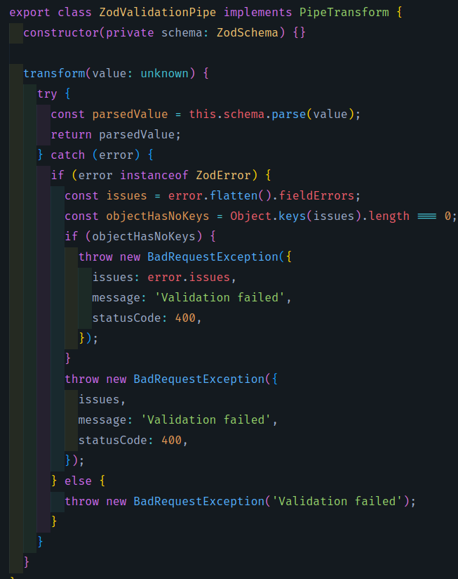

<p align="center">
  
</p>

## Descrição

API criada com o intuito de realizar o teste para desenvolvedor fullstack na Bankme.

O Backend feito em Node.JS utilizar o framework Nest.JS, um arquétipo opinado que conta com inúmeras facilidades para desenvolvedores que desejam criar apis.

No texto a seguir serão explicados o pontos mais importantes e o conceitos utilizados nessa API.

## Variáveis de ambiente
```bash
PORT="8080" // porta em que a aplicação vai rodar
FRONTEND_URL="http://localhost:3000" // URL do frontend para o cors
CRYPT_ROUNDS="10" // rounds de criptografia
JWT_SECRET="c7bb8033-71c8-4780-95e4-f19fd437a6a3" // segredo para geração de JWT
JWT_EXPIRES_IN="1d" // expiração do JWT
MAIL_HOST="smtp.ethereal.email" // host do email, caso você queira ver o envio de email funcionando recomendo o uso da seguinte plataforma, ela fornecesse todas essas informações de host, port, user e password sem precisar criar conta. Além de fornecer a visualização da caixa de email https://ethereal.email/ basta clicar em Create Ethereal Account para ter as informações deste ENV
MAIL_PORT="587"
MAIL_USER="chance.johnston91@ethereal.email"
MAIL_PASSWORD="7zBm9S2VpmSKRScag8"
```

## Como rodar a aplicação (localmente)

```bash
$ pnpm install // instalar as dependencias
$ pnpm db:up // subir o container do Redis utilizado pelas filas da aplicação
$ pnpm db:migrate // rodas as migrações do prisma
$ pnpm db:studio // (opcional) caso queira visualizar o banco de dados
$ pnpm start:dev // inicializar a aplicação
```

## Como rodar a aplicação (com container Docker)
```bash
$ pnpm start:dev
$ pnpm docker:build
$ pnpm docker:run
```
## Explicação da arquitetura

### Schema Validation
Para ter dados consistentes e que estão de acordo com a lógica de negócios da aplicação, foi utilizaro o [Zod](https://zod.dev/), um biblioteca de validação de dados e tipagem estática extremamente flexível e cabível para situação onde precisamos que os dados vindo do cliente da API sejam extremamente consistentes. A imeplemtação foi feita através da Pipe ZodValidationPipe que é utilizada nos parametros de body, params, entre outros.
### Validation Pipe


### Utilização


### Autenticação
A autenticação no sistema foi feita utilizando tokens JWT com expiração definivida por uma variavel de ambiente JWT_EXPIRES_IN, além de um secret (JWT_SECRET). A cada request que é feito para a API antes de passar pelo fluxo de obtenção dos dados, uma checagem é feita pelo AuthGuard para garantir que o consumidor está passando um token valido e não expirado.

### Auth Guard


### Utilização


### Criptografia da senha
Para a senha foi feito uma criptografia baseada em rounds a partir da biblioteca bcrypt

### Criptografando a senha para persistir


### Descriptografando na tentativa do login


### Filas
As filas no projeto foram implementadas a partir da biblioteca [Bull](https://github.com/OptimalBits/bull). Com essa lib conseguimos criar uma classe produtora e outra consumidora, e ela trata de lidar com as ações encadeadas. Foi implementado tanto a fila de criação em lote dos payables quanto a fila morta. O email que seria do time de operações pode ser visualizado aqui https://ethereal.email/messages, ele será abastecido sempre que um Payable indevido não conseguir ser cadastrado

### Testes
No que se refere aos testes, fora implementados testes para os principais UseCases da aplicação

### Fluxo completo da API
POST
1. Os dados entram na API caso estejam válidos, a partir do controller;
2. O controller encaminha esse DTO para o Use Case
3. O use case, onde está localizado toda a lógica de negócios da aplicação, tem a responsabilidade de criar as entidades e fazer os devidos tratamentos para que o repository tenha a capacidade de criar a entidade
4. O repository através de um ObjectMapper para persistencia, tenta introduzir aquele dado em uma base de dados
5. Em caso de sucesso o repository retorna para a API um objeto de domínio, ou seja uma nova entidade, a a partir de outro ObjectMapper, só que dessa vez para o domínio
6. o use case faz os devidos tratamentos no retorno e encaminha para o controller novamente
7. o controller a partir de um ObjectViewModel retorna o objeto para o usuário

GET
1. Uma query é feita e o controller deve ser responsavel por encaminhar esses dados para o use case
2. O use case trata esse dados brutos, lançando erros quando necessário
3. Caso esteja tudo OK, ele encaminha esse query para o repository, que busca os dados devidamente
4. Através de um ObjectMapper, o repository retorna esses dados para o use case depois de passar pelo Object Mapper para persistencia
5. O use case retorna para o controller
6. O controller retorna para o usuário passando por um ViewModel

PATCH
1. Os dados entram na API caso estejam válidos, a partir do controller;
2. O controller encaminha esse DTO para o Use Case
3. O use case, onde está localizado toda a lógica de negócios da aplicação, tem a responsabilidade de criar as entidades e fazer os devidos tratamentos para que o repository tenha a capacidade de atualizar a entidade
4. O repository através de um ObjectMapper para persistencia, tenta introduzir aquele dado em uma base de dados
5. Em caso de sucesso o repository retorna para a API um objeto de domínio, ou seja uma nova entidade, a a partir de outro ObjectMapper, só que dessa vez para o domínio
6. o use case faz os devidos tratamentos no retorno e encaminha para o controller novamente
7. o controller a partir de um ObjectViewModel retorna o objeto para o usuário

DELETE
1. O controller recebe os parametros da deleção
2. O use case trata esses pametros para encaminhar para a camada de repository
3. O repository não lança nenhum erro caso tenha ocorrido sucesso
4. Nada é retornado para o use case
5. Nada é retornado para o controller
