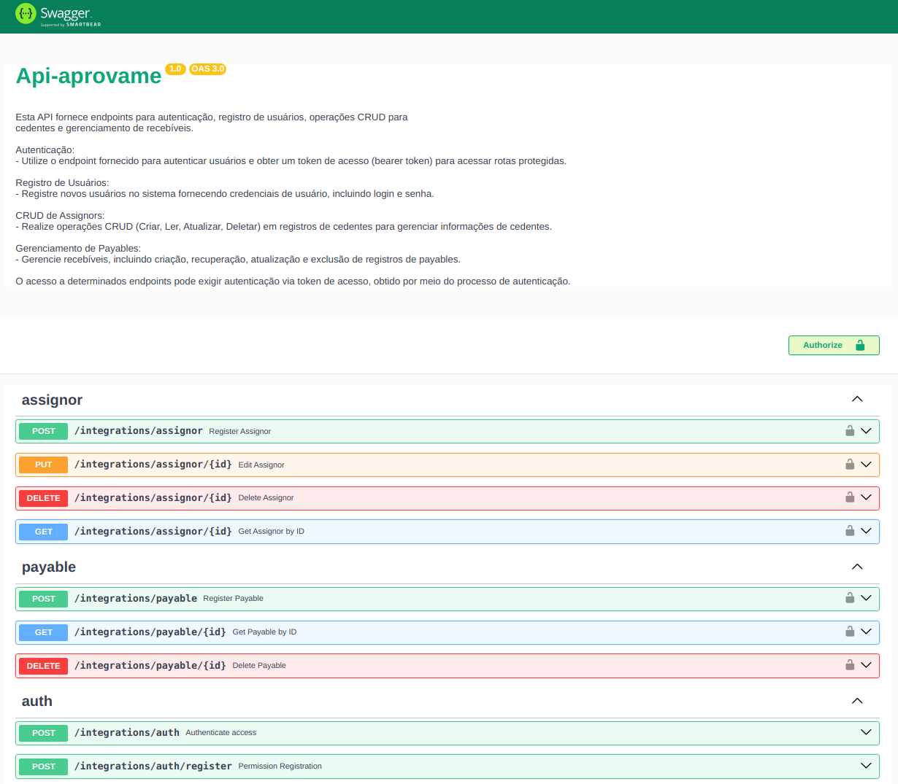
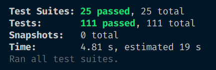

<p align="center">
  
</p>

# Receivable Hub - Backend

Este repositório contém o backend da aplicação Receivable Hub, uma plataforma para gerenciamento de recebíveis.

## Autenticação

Implementamos um sistema de autenticação em todas as rotas. Criamos uma nova rota:

```shell
POST /integrations/auth
```

Essa rota recebe as credenciais do usuário e retorna um JWT com tempo de expiração de 1 minuto. O JWT é enviado como parâmetro do Header da requisição em todas as outras rotas.

## Recebíveis (Payables)

As rotas relacionadas aos recebíveis são:

- `POST /integrations/payable`: Cadastro de um novo recebível.
- `GET /integrations/payable/:id`: Obtém um recebível por ID.
- `DELETE /integrations/payable/:id`: Deleta um recebível existente.
- `POST /integrations/payable/batch`: Processa um lote de recebíveis.

## Cedentes (Assignors)

As rotas relacionadas aos cedentes são:

- `POST /integrations/assignor`: Cadastro de um novo cedente.
- `GET /integrations/assignor/:id`: Obtém um cedente por ID.
- `PUT /integrations/assignor/:id`: Edita um cedente existente.
- `DELETE /integrations/assignor/:id`: Deleta um cedente existente.

## Gerenciamento de Permissões

Para gerenciamento de permissões, temos as seguintes rotas:

- `POST /integrations/permissions`: Cadastro de uma nova permissão.
- `POST /integrations/auth`: Autenticação utilizando as permissões cadastradas.

## Testes

Foram criados testes unitários para o core da aplicação, garantindo a cobertura dos principais arquivos e funcionalidades.

<p align="start">
  
</p>

## Persistência

Utilizamos o Prisma para incluir um novo banco de dados SQLite.

## Validação

Na implementação da API utilizando NestJS, focamos em uma abordagem orientada a domínio rico, utilizando objetos de valor para garantir a validação independente de bibliotecas externas. Todos os campos recebidos são validados para garantir que nenhum deles seja nulo, e que os IDs sejam do tipo UUID.

## Endpoints da API

- [Documentação da API](http://localhost:3001/api/docs/v1) - Documentação detalhada dos endpoints da API.

## Contato

Para mais informações ou sugestões, entre em contato com a equipe de desenvolvimento em [elvesbd41@gmail.com](mailto:elvesbd41@gmail.com).
