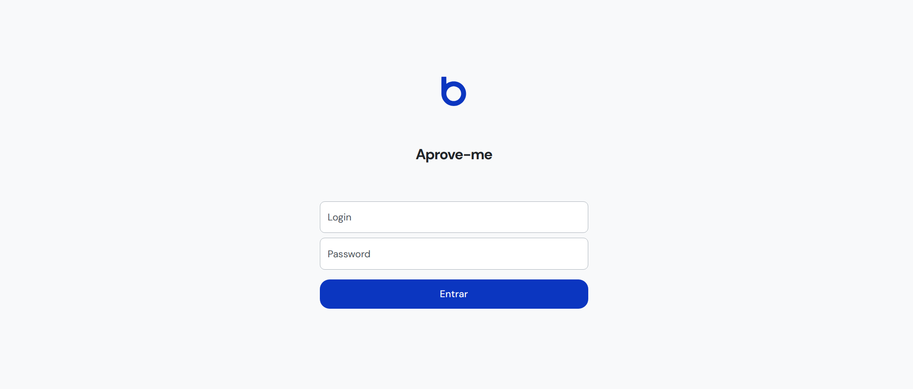

  

# Receivable Hub - Frontend

Este é o frontend do projeto Receivable Hub, desenvolvido utilizando React.js. A aplicação oferece uma interface para a autenticação dos usuários e redirecionamento para o dashboard após o login bem-sucedido.

## Funcionalidades Implementadas

- **Autenticação**: Implementação da tela de login onde os usuários podem inserir suas credenciais.
- **Redirecionamento**: Após a autenticação bem-sucedida, os usuários são redirecionados para o dashboard.

## Tecnologias Utilizadas

- **Frontend**: [React.js](https://reactjs.org/), [Vite](https://pt.vitejs.dev/guide/)

## Contato

Para mais informações ou sugestões, entre em contato com a equipe de desenvolvimento em [elvesbd41@gmail.com](mailto:elvesbd41@gmail.com).
