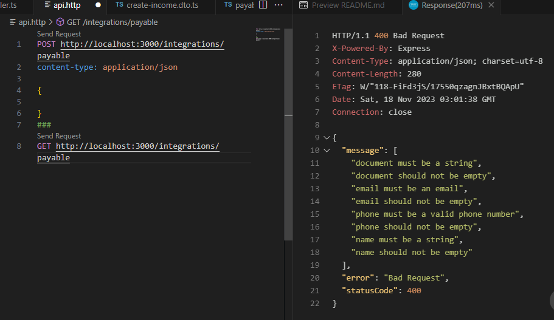
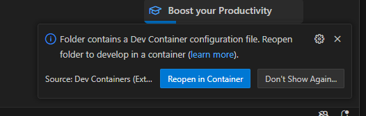
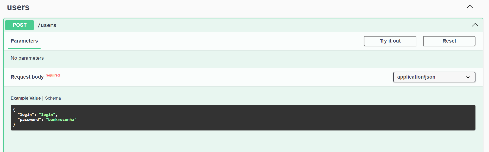

## Descrição

Esta API foi criada para atender aos requisitos do processo seletivo da bankme, com diferentes niveis de maturidade. 

```
[x] Nível 1 - Validação.
[x] Nível 2 - Persistência
[ ] Nível 3 - Testes
[x] Nível 4 - Autenticação
[x] Nível 5 - Gerenciamento de permissões
[x] Nível 6 - Infra e Doc
[ ] Nível 7 - Lotes
[ ] Nível 8 - Resiliência
[ ] Nível 9 - Cloud
[ ] Nível 10 - Infra as a Code
```
[Click aqui para mais detalhes](https://github.com/TiagoGIM/aprove-me#readme)

#### Nível 1 VALIDAÇÃO

foram criados 2 recursos nesta etapa, um crud para recebíveis e outro para cedentes

> **/payable**


Usando recurso da propria CLI
```bash
#crud payable
$ npx nest generate resource payable

# crud assignor
$ npx nest generate resource assignor
```

Para  fazer a validaçao dos campos foram usadas duas bibliotecas, uma para validaçao e outra para (de)serializar dados.


```bash
$  class-validator class-transformer
```

Como foi preciso um desenvolvimento rápido, foi usada uma extensão que já esta incluída no container ,**rest-api**, onde simples chamadas podem ser feitas pelo o arquivo [api.http](/recebiveis-api2/api.http). 




#### Nível 2 PERSISTENCIA

Para persistir os dados usando o prisma foi criado o service prisma globalmente

```bash
$ npx nest generate service prisma
```

Os schemas usados seguiram 

#### Nível 4 e 5 - Autenticação e Gerenciamento de Permissões

seguindo a documentaçao de [nest.js](https://docs.nestjs.com/recipes/passport) foi usado o passaport, jwt e bcript para fazer a autenticaçao, para isso foi criado um recurso **user**, para criaçao de usuario com apenas login e senha, o modulo de **auth** com toda configuraçao necessaria para fazer autenticaçao usando jwt. 

Por segurança usamos uma hash para salvar as senhas com criptografia, a chave ficou salva em variavel de ambiente, JWT_SECRET="zjP9h6ZI5LoSKCRj" , que para efeito de estudo se mantem no arquivo .env na raiz do projeto.

#### Nível 6 Infra e Doc

Foi criado um `Dockerfile` para comportar a API e um `Docker-compose` Para subir a infraestrutura de uma vez.
O objetivo desde o inicio era chegar ao nivel 7 e colocar uma arquitetura de mensageria, mas devido ao prazo apenas se iniciou essa etapa de arquitetura com o `Rabbitmq` que já esta configurado e com um service `batch` com um Producer que publica mensagens em uma fila especifica para testes.


### Principais diretórios
```
api/
├── .devcontainer/
├── prisma/
├── src/
│   ├── assignor
│   ├── auth
│   ├── batch
│   ├── payable
│   ├── prisma
│   ├── users
│   ├── app.controller.ts
│   ├── app.module.ts
│   ├── app.service.ts
│   └── main.ts
└── demais arquivos...
```


## Como rodar o projeto

O projeto do backend foi desde o inicio seguindo a abordagem de desenvolvimento em container. Porém para rodar o projeto basta ter o Docker, e o node instalado.  Em modo de desenvolvimento pode ser usar o Vscode e o Docker.

### Docker e VsCode
O repositório conta com a pasta .devcontainer que ja tem todas as extenssões principais instaladas, **pretier**, **prisma** entre outras, para facilitar a vida da equipe de desenvolvimento. Basta ter o vscode e a ext 
`devcontainer`
 que automaticamente uma caixa de dialogo ira perguntar se deseja abrir em container.  



No terminal do container que abrira no vscode entre com os comandos

```bash
$ npm install
```
E para rodar a aplicação  

```bash
$ npx next start:dev
``` 


### No Terminal Linux ou Windows 

```bash
# instalation
$ npm install

# development
$ npm run start

# watch mode
$ npm run start:dev

# production mode
$ npm run start:prod
```

### Swagger e Primeiro Login

Para iniciar o uso da API primeiramente crie um usuário:

Com o projeto rodando abra o swagger no link http://localhost:3001/api



Em seguida na rota Auth faça faça o login, copie o token e cole no `Authorize` no topo da página.

Agora você já pode testar as outras rotas que devem estar protegidas.

Agora é rodar o fronEnd e logar com o novo usaurio que voce criou.

[FrontEnd](/recebiveis-front/README.md)


## EndPoints Disponivéis

### Assignor Resource

- **Create Assignor**
  - Método: `POST`
  - Endpoint: `/integrations/assignor`
  - Descrição: Cria um novo registro de assignor.

- **Get All Assignors**
  - Método: `GET`
  - Endpoint: `/integrations/assignor`
  - Descrição: Obtém todos os registros de assignor.

- **Get Assignor by ID**
  - Método: `GET`
  - Endpoint: `/integrations/assignor/:id`
  - Descrição: Obtém um registro de assignor específico com base no ID.

- **Update Assignor by ID**
  - Método: `PATCH`
  - Endpoint: `/integrations/assignor/:id`
  - Descrição: Atualiza um registro de assignor específico com base no ID.

- **Delete Assignor by ID**
  - Método: `DELETE`
  - Endpoint: `/integrations/assignor/:id`
  - Descrição: Exclui um registro de assignor específico com base no ID.

### Auth Resource

- **Login**
  - Método: `POST`
  - Endpoint: `/auth/login`
  - Descrição: Autentica um usuário com base nas credenciais fornecidas.

### Payable Resource

- **Create Payable**
  - Método: `POST`
  - Endpoint: `/integrations/payable`
  - Descrição: Cria um novo registro de payable.

- **Get All Payables**
  - Método: `GET`
  - Endpoint: `/integrations/payable`
  - Descrição: Obtém todos os registros de payable.

- **Get Payable by ID**
  - Método: `GET`
  - Endpoint: `/integrations/payable/:id`
  - Descrição: Obtém um registro de payable específico com base no ID.

- **Update Payable by ID**
  - Método: `PATCH`
  - Endpoint: `/integrations/payable/:id`
  - Descrição: Atualiza um registro de payable específico com base no ID.

- **Delete Payable by ID**
  - Método: `DELETE`
  - Endpoint: `/integrations/payable/:id`
  - Descrição: Exclui um registro de payable específico com base no ID.

### Users Resource

- **Create User**
  - Método: `POST`
  - Endpoint: `/users`
  - Descrição: Cria um novo registro de usuário.

- **Get All Users**
  - Método: `GET`
  - Endpoint: `/users`
  - Descrição: Obtém todos os registros de usuário.


## Stay in touch

- Author - [Tiago Almeida](https://kamilmysliwiec.com)
- Twitter - [@tiagoGIM](https://twitter.com/tiagoGIM)

## License

recebiveis-api is [MIT licensed](LICENSE).
