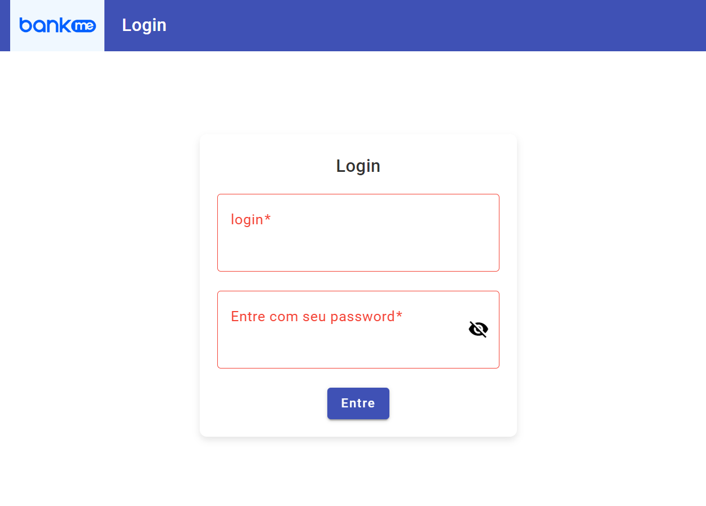

# RecebiveisFront

Assim como a API `Recebiveis-api2` foi seguida uma sequência de niveis a serem solucionados.


🖥️ Front-end
- ✅ Nível 1 - Cadastro
     -
     - ✅ Criar Formulário de Cadastro de Recebivel
     - ✅ Usar ValidaÇao de campos para previnir Badrequest.
     - ✅ Criar pagina para exibir recebivel com detalhes, incluindo Cedente.

- ✅ Nível 2 - Conectando na API
    -
    -   ✅ Persistencia de dados de recebivel no backend.
    -   ✅ Cadastro de Cedente
    -   ✅ Uso de reatividade para carregar todos os cedentes disponiveis em um seletor dropdown

- ✅ Nível 3 - Listando
    -
    - ✅ Page com listagens de pagáveis. Mostrando apenas: `id`, `value` e `emissionDate`.
    - ✅ Para cada ítem da lista, coloque um link que mostra os detalhes do pagável.
    - ✅ Criaçao de açoes de editar e excluir para cada elemento. (feito com reuso dos forumarios)


- ✅ Nível 4 - Autenticação
    -
    - ✅ Tela de login
    - ✅ Rotas autenticadas, com uso de guard e jwt.
    - ✅ Mecanismo para retornar a tela de login caso o token expire e perca a sessao.

- ⬜  Nível 5 - Testes
    -
    - Fica pra próxima. ainda faço om storybook. ❤️


## Desenvolvimento

Foi feito o uso de diversas tecnicas de desenvolvimento.  
para criaçao dos componentes  de forma mais estilizada foi usado o system disgn [Angular Material](https://material.angular.io/). 

O aplicativo foi desenvolvido para ter 4 paginas, listagem de recebiveis, cadastro, detalhes e login.

Com exceçao da rota de login, todas as outras telas estao protegidas, e caso tente-se burlar essa etapa, automaticamente a tela é redirecionada para login novamente.  Para isso foi feito uso de um interceptor que sempre valida se existe um token para a requisiçao em questao. caso contrario o usuario é sempre redirecionado para o `login`.



## Formularios de cadastro
Foram Criados dois Formularios para serem usado na tela de cadastro, Assignor e Payable. Os mesmos formularios sao usados para editar.

## Gerenciamento do eventos
Para evitar gerenciamento de Observables, adotei a abordagem de usar pipe `Async` se,pre que possivel, dessa forma  a própria pagina é responsável por se inscrever e desiscrever nos eventos de requisiçao de dados ao backend. [saiba mais](https://warcontent.com/angular-async-pipe/).

Um exemplo é o link de cadastrar que só é exibido caso uma chamada para verificar o token retorne ok.
`authed$` é um evento assincrono gerenciado pela propria view.


```html
<button *ngIf="(authed$ | async)" mat-button [matMenuTriggerFor]="beforeMenu">Cadastrar</button>
```


## Instalação

```bash
# Instala todos os modulos necessarios. 
 $ npm install

# Rodar em desenvolvimento
 $ npx ng serve
```

Abra um navegador da web e acesse `http://localhost:4200`

## Docker 

Caso deseje rodar em container, foi criado um `DockerFile` com uma imagem do node e outra do nginx, por questão puramente de performance. Basta rodar esses comandos no mesmo logal do arquivo.

```bash
# Cria a imagem
$ docker build -t front-recebiveis

# Inicia a plicaçao
$ docker run -p 8080:80 front-recebiveis

```

Neste caso a porta 8080 do host será mapeada para a porta 80 do contêiner.
Abra um navegador da web e acesse `http://localhost:8080`

